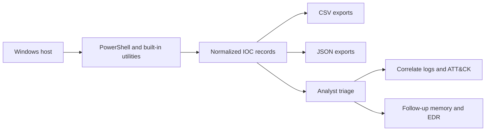
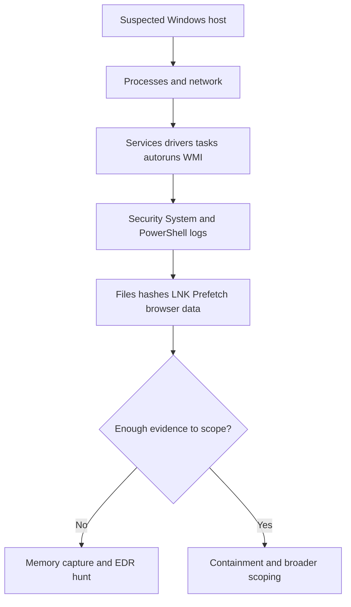

# Windows IOC Identification and PowerShell Collection

## Executive summary

NIST’s incident-handling guidance treats effective collection, analysis, and reporting of incident data as a core part of incident response, and its malware-specific guidance emphasizes rapidly validating suspected malware, identifying affected hosts, and using multiple host-identification strategies rather than relying on a single signal. In practice, that means Windows triage should collect both **live state** and **persistent state**, then normalize the results into a schema that analysts can search, diff, and correlate across hosts. citeturn12view0turn13view0turn12view1turn13view3

On Windows 10/11 and Server 2016+, built-in PowerShell and native Windows utilities are sufficient for a strong first-pass IOC sweep. Microsoft’s cmdlets and WMI/CIM classes expose running processes, services, scheduled tasks, startup commands, drivers, certificates, local users, and event logs; `Get-WinEvent` can query both classic Windows logs and ETW-backed channels, including the PowerShell Operational log. Microsoft also documents that `Get-WmiObject` has been superseded by `Get-CimInstance`, which is the preferable default for modern collection. citeturn6view0turn5search1turn5search4turn27search0turn27search2turn27search3turn31search0turn26search0turn31search3

The most valuable Windows IOC categories for host triage are: processes with command lines and owners; services and drivers; scheduled tasks and PowerShell scheduled jobs; autoruns and Run keys; network connections/listeners; WMI permanent event subscriptions; PowerShell logs; key Security/System events; file artifacts and hashes; Prefetch and LNK shortcuts; browser-profile artifacts; certificates; and account state. SANS and other DFIR sources are especially useful for blind spots: hidden services can evade ordinary enumeration, WMI persistence is often overlooked, LNK/Prefetch artifacts preserve execution context, and browser artifacts are central in credential-theft investigations. citeturn22search18turn22search2turn22search5turn24search2turn24search6turn23search6turn24search3turn17search15

A rigorous workflow is therefore: collect host evidence into a **single normalized schema**, enrich it with log/event context and ATT&CK mappings, triage for suspicious outliers, and then escalate when the host-only picture is incomplete. NIST’s malware guidance explicitly recommends deeper malware study and multiple identification approaches; for modern intrusions, that often means a follow-up memory capture and EDR/telemetry queries when PowerShell, WMI, or in-memory tooling is suspected. citeturn12view1turn13view2turn13view3

## Scope and collection principles

This report assumes Windows 10/11 and Windows Server 2016+; where a capability is version-sensitive, that is called out. Windows PowerShell 5.1 is the default Windows-bundled shell, while PowerShell 7 installs side-by-side. For incident-response collection on Windows, 64-bit PowerShell is strongly preferred because Microsoft documents two important completeness issues: the `Microsoft.PowerShell.LocalAccounts` module is unavailable in 32-bit PowerShell on a 64-bit system, and 32-bit PowerShell can return incomplete module visibility for 64-bit processes when using `Get-Process`. citeturn8search4turn11search0turn31search0turn6view0

Two practical principles matter more than tool choice. First, use **structured output** by default: PowerShell objects convert cleanly to JSON, and CSV remains useful for host-to-host comparison and spreadsheet triage. Second, collect enough context to support correlation, not just a raw artifact list. A process record without its parent, owner, and command line is far less useful than a normalized row that can be tied to Security event 4688, a 4104 script block, a scheduled task action, or a service install event. CSA’s definition of audit logs as records of “who did what and when” is a useful way to think about the minimum defensible host schema. citeturn7search0turn11search1turn18search2turn17search15turn18search0turn19search22turn21search4



A good default for collection is to establish a time window first, then apply it wherever the artifact family supports time filtering. Some Windows sources expose explicit timestamps (`CreationDate`, `StartTime`, `LastRunTime`, `LastWriteTime`, event `TimeCreated`); others do not. Where native timestamps are not reliably exposed by the built-in interface, the report calls that out and recommends event-log or EDR correlation instead of pretending the source is richer than it is. That distinction matters for registry state, WMI subscription objects, and some network enumerations. citeturn30search1turn31search3turn20search1turn20search5turn20search9

## Standardized IOC schema

NIST SP 800-61 notes that incident response benefits from collecting defined, repeatable data fields, and specifically points readers to suggested incident data fields in Appendix B. For Windows-focused IOC work, the best operational interpretation is a **normalized host IOC schema** with a common superset of fields, plus category-specific required subsets. citeturn12view0turn13view1

### Core normalized fields

| Field | Purpose |
|---|---|
| `ComputerName` | Host where the IOC was collected |
| `CollectionTimeUtc` | Time the collector wrote the record |
| `Category` | IOC category such as `Process`, `Service`, `ScheduledTask` |
| `Name` | Process/service/task/file/user/certificate/display name |
| `Path` | Executable path, file path, module path, or store path |
| `Hash` | Usually SHA-256 for file-backed artifacts |
| `HashAlgorithm` | `SHA256` unless a different algorithm is explicitly required |
| `Timestamp` | Primary artifact timestamp for the record |
| `Owner` | User, service account, or certificate subject owner context |
| `PID` | Process ID where applicable |
| `ParentPID` | Parent process ID where applicable |
| `CommandLine` | Process command line, task action arguments, script text pointer, etc. |
| `RegistryPath` | Registry location when the artifact is registry-backed |
| `EventIDs` | Relevant event identifiers correlated to the artifact |
| `Source` | Native source such as `Win32_Process`, `Security`, `PowerShell/Operational`, `Registry Run Key` |
| `Severity` | Analyst-assigned rating using local triage rubric |
| `Notes` | Free-text reasoning, false-positive explanation, or follow-up needed |

### Category-to-required-fields matrix

The table below lists the **minimum fields that should be populated** for each category. A normalized record can include more fields whenever they exist.

| IOC category | Minimum required fields from the normalized schema | Primary rationale and references |
|---|---|---|
| Running processes | `Name`, `Path`, `Timestamp`, `Owner`, `PID`, `ParentPID`, `CommandLine`, `Source`, `Severity`, `Notes` | Core live-state visibility; process owner and module visibility are documented through `Get-Process` and `Win32_Process`. citeturn6view0turn5search1turn14search0 |
| Services | `Name`, `Path`, `Owner`, `PID`, `CommandLine`, `RegistryPath`, `Source`, `Severity`, `Notes` | Services are persistent and execution-relevant; hidden-service edge cases are well documented by SANS. citeturn27search3turn22search18turn19search22 |
| Scheduled tasks | `Name`, `Path`, `Timestamp`, `Owner`, `CommandLine`, `Source`, `Severity`, `Notes`, `EventIDs` | Task definitions and last-run metadata come from the ScheduledTasks module; creation can be correlated to 4698. citeturn30search0turn30search1turn18search0turn16search0 |
| Autoruns and startup items | `Name`, `Path`, `Timestamp`, `Owner`, `CommandLine`, `RegistryPath`, `Source`, `Severity`, `Notes` | Startup commands and Run keys capture common boot/logon persistence. citeturn27search2turn14search2 |
| Network connections, listeners, open ports | `Name`, `PID`, `ParentPID`, `Path`, `Owner`, `Timestamp` if available, `Source`, `Severity`, `Notes` | Network state should be joined back to process context; ATT&CK treats host/network enumeration as Discovery. citeturn3search6turn4search1turn14search4 |
| Loaded drivers | `Name`, `Path`, `Timestamp` where derivable from backing file, `Source`, `Severity`, `Notes` | Driver state is exposed through `Win32_SystemDriver` and `driverquery`. citeturn27search0turn27search1 |
| Loaded DLLs/modules | `Name`, `Path`, `PID`, `Timestamp` where derivable from backing file, `Source`, `Severity`, `Notes` | Module visibility is available from `Get-Process -Module`, but with documented privilege and architecture caveats. citeturn6view0 |
| File system artifacts | `Name`, `Path`, `Hash`, `Timestamp`, `Owner`, `Source`, `Severity`, `Notes` | Disk artifacts support malware validation, persistence review, and chronology. citeturn31search1turn12view1 |
| Registry keys | `Name`, `RegistryPath`, `CommandLine` or configured value, `Source`, `Severity`, `Notes` | Registry-backed execution and persistence remain common; ATT&CK maps registry modification explicitly. citeturn15search2 |
| Event logs | `Name` or event description, `Timestamp`, `Owner`/subject if present, `PID`, `CommandLine` if present, `EventIDs`, `Source`, `Severity`, `Notes` | `Get-WinEvent` supports classic and ETW-backed channels; process, task, service, and PowerShell events are high-value. citeturn31search3turn18search2turn18search0turn19search22turn17search15 |
| User accounts and groups | `Name`, `Owner` or principal source, `Timestamp` such as `LastLogon` or `PasswordLastSet`, `Source`, `Severity`, `Notes` | Local user-state enumeration is built in; use 64-bit PowerShell on 64-bit hosts. citeturn31search0 |
| Persistence mechanisms | `Category`, `Name`, `Path`, `Timestamp`, `Owner`, `CommandLine`, `RegistryPath`, `EventIDs`, `Source`, `Severity`, `Notes` | This is a composite analytic category derived from services, tasks, Run keys, startup folders, WMI, and scheduled jobs. citeturn14search2turn16search0turn20search1turn20search5 |
| WMI subscriptions and WMI execution artifacts | `Name`, `CommandLine`, `Source`, `Severity`, `Notes`, `EventIDs` if correlated | Permanent-event-subscription components are `__EventFilter`, consumer classes, and `__FilterToConsumerBinding`; SANS highlights their stealth. citeturn20search1turn20search5turn20search9turn22search5 |
| PowerShell logs | `Timestamp`, `CommandLine` or script content, `Owner` if inferable, `EventIDs`, `Source`, `Severity`, `Notes` | Microsoft documents module and script-block logging; 4103 and 4104 are especially useful in practice. citeturn17search0turn17search2turn17search15 |
| LNK and Prefetch | `Name`, `Path`, `Timestamp`, `Owner`, `Source`, `Severity`, `Notes` | SANS and TrustedSec both show these artifacts preserve execution or access context that is highly valuable in DFIR. citeturn24search2turn24search6turn23search6 |
| Browser artifacts | `Name`, `Path`, `Timestamp`, `Owner`, `Source`, `Severity`, `Notes` | Browser profiles, history, cookies, and credential stores are frequently targeted by credential harvesters. citeturn24search3turn25search8turn25search9turn25search24 |
| Certificates | `Name`, `Path` or store path, `Timestamp` (`NotBefore`/`NotAfter`), `Source`, `Severity`, `Notes` | Microsoft exposes certificate stores through the `Cert:` provider; `certutil` is the native alternative. citeturn26search0turn26search2turn26search4 |
| Scheduled jobs | `Name`, `CommandLine`, `Timestamp`, `Owner`, `Source`, `Severity`, `Notes` | PowerShell scheduled jobs are distinct from ordinary scheduled tasks, live in the `PSScheduledJob` module, and are stored on disk and registered in Task Scheduler. citeturn29search1turn29search2turn29search10turn29search19 |
| Memory artifacts | `Category`, `Name`, `PID`, `Path`, `Source`, `Severity`, `Notes` | Full volatile-memory capture is not comprehensively covered by built-in PowerShell alone; treat this as a follow-up domain. citeturn12view1turn13view3 |
| Hashes | `Name`, `Path`, `Hash`, `HashAlgorithm`, `Timestamp`, `Source`, `Severity`, `Notes` | Hashing is the canonical way to normalize file-backed evidence for validation and pivoting. citeturn31search1 |

## Collection commands and comparison matrices

The following sections are designed for **repeatable collection**. Use a common time anchor first:

```powershell
$Start = (Get-Date).AddDays(-7)
$Out   = "C:\IR\$env:COMPUTERNAME-$(Get-Date -Format 'yyyyMMdd_HHmmss')"
New-Item -ItemType Directory -Path $Out -Force | Out-Null
```

Where a row says “CSV” or “JSON,” append one of these patterns:

```powershell
# CSV
... | Export-Csv "$Out\<name>.csv" -NoTypeInformation -Encoding UTF8

# JSON
... | ConvertTo-Json -Depth 5 | Set-Content "$Out\<name>.json" -Encoding UTF8
```

### Live execution and network state

| Category | Primary PowerShell collection command | Built-in alternative | Timestamp filtering | Privileges | Output example | Notes, tips, and references |
|---|---|---|---|---|---|---|
| Running processes | `Get-CimInstance Win32_Process \| Select-Object Name,ExecutablePath,CreationDate,ProcessId,ParentProcessId,CommandLine`  <br><br>`Get-Process -IncludeUserName \| Select-Object Name,Id,UserName,Path,StartTime` | `tasklist /v /fo csv` | `... | Where-Object { $_.CreationDate -ge $Start }` | Standard user is often enough for `Win32_Process`; admin is recommended for completeness. | `... > "$Out\processes.json"` | Use `Win32_Process` when you need `CommandLine`, `ParentProcessId`, and `CreationDate`. `Get-Process -Module` and `-FileVersionInfo` require elevation for processes you do not own, and 32-bit PowerShell can miss 64-bit module details. Suspicious patterns: script hosts, LOLBINs, odd parent-child chains, and binaries executing from user-writable paths. ATT&CK: `T1057 Process Discovery`. citeturn5search1turn6view0turn14search0turn14search24 |
| Loaded DLLs/modules | `Get-Process -Module \| Select-Object Id,ProcessName,ModuleName,FileName,ModuleMemorySize` | `tasklist /m /fo csv` | After collection, enrich with file timestamps: `... | ForEach-Object { $f=Get-Item $_.FileName -ErrorAction SilentlyContinue; $_ | Add-Member NoteProperty LastWriteTime $f.LastWriteTime -PassThru }` | Admin recommended; 64-bit PowerShell strongly preferred. | `... | Export-Csv "$Out\modules.csv" -NoTypeInformation` | High-signal hits are modules loaded from `%TEMP%`, user profile directories, or unexpected application subfolders. Treat module enumeration as supporting evidence; by itself it does not prove malicious hijacking. citeturn6view0 |
| Network connections and listeners | `Get-NetTCPConnection \| Select-Object LocalAddress,LocalPort,RemoteAddress,RemotePort,State,OwningProcess`  <br><br>`Get-NetUDPEndpoint \| Select-Object LocalAddress,LocalPort,OwningProcess` | `netstat -abno` | Native per-connection creation time is not consistently exposed across built-in paths; correlate to process creation or EDR/network telemetry instead. | Standard collection often works; admin is recommended for the richest process correlation. | `... | Export-Csv "$Out\nettcp.csv" -NoTypeInformation` | Immediately join `OwningProcess` back to `Win32_Process` so each port has file path and command line. Focus on public remote IPs, uncommon listeners, and “system-looking” processes running from non-system locations. ATT&CK: Discovery tactic `TA0007` is the right high-level lens if an actor is enumerating host/network state. citeturn3search6turn4search1turn14search4 |
| Open ports joined to process context | `Get-NetTCPConnection \| ForEach-Object { $p = Get-CimInstance Win32_Process -Filter "ProcessId=$($_.OwningProcess)" -ErrorAction SilentlyContinue; [pscustomobject]@{LocalAddress=$_.LocalAddress;LocalPort=$_.LocalPort;RemoteAddress=$_.RemoteAddress;RemotePort=$_.RemotePort;State=$_.State;PID=$_.OwningProcess;ProcessName=$p.Name;Path=$p.ExecutablePath;CommandLine=$p.CommandLine} }` | `netstat -abno` plus `tasklist /svc /fo csv` | As above | Admin recommended | `... > "$Out\ports_joined.json"` | This joined view is usually more actionable than raw port tables. Legitimate management agents and line-of-business apps routinely create persistent listeners, so severity should depend on path, signer, user context, and parentage, not just port number. citeturn3search6turn4search1turn5search1 |
| Services | `Get-CimInstance Win32_Service \| Select-Object Name,DisplayName,State,StartMode,StartName,ProcessId,PathName` | `Get-Service`; `sc.exe query type= service state= all`; `sc.exe qc <name>` | For chronology, pivot to event logs rather than the service object itself: `Get-WinEvent -FilterHashtable @{LogName='System'; Id=7045; StartTime=$Start}` | Standard user may enumerate many services; admin is recommended for completeness and corroboration. | `... | Export-Csv "$Out\services.csv" -NoTypeInformation` | Win32 service data is better than `Get-Service` for IR because it includes `PathName`, `StartName`, and `ProcessId`. SANS has shown that hidden services can evade ordinary enumeration in `Get-Service`, `sc query`, and the GUI, so cross-check service state with registry-backed service configuration when something looks off. citeturn27search3turn30search3turn19search22turn22search18 |
| Drivers | `Get-CimInstance Win32_SystemDriver \| Select-Object Name,DisplayName,State,StartMode,PathName,ServiceType,ExitCode` | `driverquery /v /fo csv` | For backing-file timestamps, enrich with `Get-Item` against `PathName` after path normalization. | Admin recommended | `... | Export-Csv "$Out\drivers.csv" -NoTypeInformation` | Drivers are one of the highest-risk categories because they can provide stealth and privileged persistence. Look for nonstandard paths, recent changes, or driver installs that line up with 7045-like service creation activity and suspicious reboots. citeturn27search0turn27search1turn19search22 |

### Persistence, startup, and system configuration

| Category | Primary PowerShell collection command | Built-in alternative | Timestamp filtering | Privileges | Output example | Notes, tips, and references |
|---|---|---|---|---|---|---|
| Scheduled tasks | `Get-ScheduledTask \| ForEach-Object { $t=$_; $i=$t \| Get-ScheduledTaskInfo; [pscustomobject]@{TaskPath=$t.TaskPath;TaskName=$t.TaskName;State=$t.State;Author=$t.Author;LastRunTime=$i.LastRunTime;NextRunTime=$i.NextRunTime;Actions=($t.Actions \| ForEach-Object { "$($_.Execute) $($_.Arguments)" }) -join ' ; ';Triggers=($t.Triggers \| ForEach-Object { $_.TriggerType }) -join ';'} }` | `schtasks /query /fo csv /v`; `schtasks /query /tn <task> /xml` | `... | Where-Object { $_.LastRunTime -ge $Start -or $_.NextRunTime -ge $Start }` and `Get-WinEvent -FilterHashtable @{LogName='Security'; Id=4698; StartTime=$Start}` | Standard user often works; admin recommended. | `... > "$Out\tasks.json"` | Export task XML for anything suspicious so hidden settings and embedded actions are preserved. High-signal patterns include Base64-encoded PowerShell in task arguments, odd author names, tasks in unusual folders, and task actions pulling commands from the registry. ATT&CK: `T1053.005 Scheduled Task/Job`. Microsoft’s own cmdlet surface only gives “last run” metadata; for history, pivot to event logs. citeturn30search0turn30search1turn30search2turn18search0turn16search0turn30search21 |
| PowerShell scheduled jobs | `Import-Module PSScheduledJob`  <br><br>`Get-ScheduledJob \| Select-Object Name,Enabled,Command,ExecutionHistoryLength,RunAs32,Location` | Check Task Scheduler entries associated with scheduled jobs if needed. | `Get-ScheduledJob \| Where-Object { $_.Location -or $_.Name }` and then pivot to task timestamps or result folders | Use **Windows PowerShell 5.1**; this is not the normal path in PowerShell 7. | `... | Export-Csv "$Out\ps_scheduled_jobs.csv" -NoTypeInformation` | PowerShell scheduled jobs are separate from ordinary Task Scheduler tasks. Microsoft documents that they are stored on disk and registered in Task Scheduler, but `Get-ScheduledJob` only returns scheduled jobs created with `Register-ScheduledJob`, and only for the current user. citeturn29search1turn29search2turn29search10turn29search19 |
| Autoruns and startup commands | `Get-CimInstance Win32_StartupCommand \| Select-Object Name,Command,Location,User,Caption` | `reg.exe query` against Run keys; startup-folder file listings | `Get-ChildItem "$env:ProgramData\Microsoft\Windows\Start Menu\Programs\Startup","$env:APPDATA\Microsoft\Windows\Start Menu\Programs\Startup" -Force \| Where-Object { $_.LastWriteTime -ge $Start }` | Standard user is often enough; admin recommended. | `... | Export-Csv "$Out\startup_commands.csv" -NoTypeInformation` | `Win32_StartupCommand` is the fastest built-in summary of logon-start program entries. Treat it as a starting point, not the whole persistence picture. ATT&CK: `T1547 Boot or Logon Autostart Execution`. citeturn27search2turn14search2 |
| Run and RunOnce registry keys | `Get-ItemProperty -Path 'HKLM:\Software\Microsoft\Windows\CurrentVersion\Run','HKCU:\Software\Microsoft\Windows\CurrentVersion\Run','HKLM:\Software\Microsoft\Windows\CurrentVersion\RunOnce','HKCU:\Software\Microsoft\Windows\CurrentVersion\RunOnce' \| Select-Object PSPath,*` | `reg.exe query HKLM\Software\Microsoft\Windows\CurrentVersion\Run /s` and the corresponding HKCU paths | Built-in PowerShell does not expose arbitrary registry-key last-write times cleanly; use eventing, EDR, or snapshot-diffing for chronology. | Standard user can read HKCU and many HKLM paths; admin recommended. | `... > "$Out\runkeys.json"` | Severity should jump when the value points to user-profile paths, script hosts, temporary files, or encoded PowerShell. ATT&CK: `T1112 Modify Registry` and `T1547` for persistence context. citeturn15search2turn14search2 |
| WMI permanent event subscriptions | `Get-CimInstance -Namespace root\subscription -ClassName __EventFilter`  <br><br>`Get-CimInstance -Namespace root\subscription -ClassName CommandLineEventConsumer`  <br><br>`Get-CimInstance -Namespace root\subscription -ClassName ActiveScriptEventConsumer`  <br><br>`Get-CimInstance -Namespace root\subscription -ClassName __FilterToConsumerBinding` | `Get-WmiObject` against the same classes, but Microsoft recommends `Get-CimInstance` going forward. | Native object creation timestamps are not conveniently exposed here; focus on content and correlate to WMI activity or EDR. | Admin recommended | `... > "$Out\wmi_subscriptions.json"` | Microsoft documents the architecture: a permanent subscription ties an `__EventFilter` to a consumer via `__FilterToConsumerBinding`. SANS repeatedly highlights WMI event consumers as a stealthy persistence mechanism. High-signal hits are `CommandLineEventConsumer`, `ActiveScriptEventConsumer`, logon/process start triggers, or script bodies that fetch remote content. ATT&CK: `T1546 Event Triggered Execution` as the current general ATT&CK family. citeturn20search1turn20search5turn20search9turn5search4turn22search2turn22search5turn14search3 |
| Service-backed registry state | `Get-ItemProperty -Path 'HKLM:\SYSTEM\CurrentControlSet\Services\*' \| Select-Object PSChildName,ImagePath,Start,Type,ObjectName,DisplayName` | `reg.exe query HKLM\SYSTEM\CurrentControlSet\Services /s` | Registry last-write chronology is not exposed well by default; correlate changed service config to 7045 or EDR registry telemetry. | Admin recommended | `... | Export-Csv "$Out\service_registry.csv" -NoTypeInformation` | This is the most useful second opinion when SANS-style “hidden service” tricks are suspected. Compare service-registry records to `Win32_Service` and `Win32_SystemDriver`. citeturn22search18turn27search0turn27search3 |
| Certificates | `Get-ChildItem Cert:\CurrentUser\My,Cert:\LocalMachine\My -Recurse \| Select-Object Subject,Thumbprint,NotBefore,NotAfter,PSParentPath`  <br><br>`Get-ChildItem -Path Cert:\* -Recurse -CodeSigningCert` | `certutil -store my` and other store queries | `... | Where-Object { $_.NotBefore -ge $Start -or $_.NotAfter -le (Get-Date).AddDays(30) }` | Standard user for current-user stores; admin recommended for local-machine stores. | `... > "$Out\certificates.json"` | Certificates matter when attackers add trust anchors, use code-signing material, or abuse enterprise PKI paths. Microsoft documents both the `Cert:` provider and `certutil` as native methods. citeturn26search0turn26search2turn26search4 |
| Local users and groups | `Get-LocalUser \| Select-Object Name,Enabled,LastLogon,PasswordLastSet,SID,PrincipalSource` | `net user` and `net localgroup administrators` | `... | Where-Object { $_.LastLogon -ge $Start -or $_.PasswordLastSet -ge $Start }` | Use **64-bit PowerShell** on 64-bit hosts. | `... | Export-Csv "$Out\local_users.csv" -NoTypeInformation` | Watch for newly enabled dormant accounts, unexpected admin-capable local users, and service accounts added to privileged groups. Microsoft documents the 32-bit limitation explicitly. citeturn31search0 |

### Logs, filesystem artifacts, and evidence enrichment

| Category | Primary PowerShell collection command | Built-in alternative | Timestamp filtering | Privileges | Output example | Notes, tips, and references |
|---|---|---|---|---|---|---|
| PowerShell operational logs | `Get-WinEvent -FilterHashtable @{LogName='Microsoft-Windows-PowerShell/Operational'; Id=4103; StartTime=$Start}`  <br><br>`Get-WinEvent -FilterHashtable @{LogName='Microsoft-Windows-PowerShell/Operational'; Id=4104; StartTime=$Start}` | `wevtutil qe Microsoft-Windows-PowerShell/Operational /q:*[System[(EventID=4104)]] /f:text` | Built into the query | Admin or `Event Log Readers`-style access may be needed depending on channel ACLs. | `... > "$Out\powershell_4104.json"` | Microsoft documents that PowerShell logs engine, provider, and cmdlet actions to Windows event logs. In practice, 4103 (module logging) and 4104 (script block logging) are the highest-value IOC sources; Microsoft’s troubleshooting docs note that 4103 includes cmdlet details and output, while 4104 contains script content. citeturn17search0turn17search2turn17search15 |
| Key Security/System events | `Get-WinEvent -FilterHashtable @{LogName='Security'; Id=4688; StartTime=$Start}`  <br><br>`Get-WinEvent -FilterHashtable @{LogName='Security'; Id=4698; StartTime=$Start}`  <br><br>`Get-WinEvent -FilterHashtable @{LogName='System'; Id=7045; StartTime=$Start}` | `wevtutil qe Security ...`; `wevtutil qe System ...` | Built into the query | Admin or delegated log-read rights may be needed. | `... | Export-Csv "$Out\key_events.csv" -NoTypeInformation` | These three event families are especially valuable in Windows triage: 4688 for process creation, 4698 for task creation, and 7045 for service installation. The strongest analytic pattern is a chain, not an isolated event: e.g., a suspicious 4688 followed by 4698 or 7045 on the same host. citeturn18search2turn18search0turn19search22 |
| File system artifacts and suspicious recent writes | `Get-ChildItem -Path "$env:TEMP","$env:ProgramData","$env:PUBLIC","$env:USERPROFILE\Downloads","$env:APPDATA","$env:LOCALAPPDATA" -Recurse -File -ErrorAction SilentlyContinue \| Where-Object { $_.LastWriteTime -ge $Start } \| Select-Object FullName,Length,CreationTimeUtc,LastWriteTimeUtc` | `dir /s /a:-d` | `Where-Object` on `CreationTimeUtc` or `LastWriteTimeUtc` | Standard user is often enough for profile paths; admin recommended for system-wide paths. | `... | Export-Csv "$Out\recent_files.csv" -NoTypeInformation` | This is the quickest way to surface staged droppers, downloaded archives, renamed scripts, and payloads under user-writable paths. Treat this as a broad net, then hash the subset that matters. citeturn12view1turn31search1 |
| Hashes | `Get-FileHash -Path <PATH> -Algorithm SHA256` | `certutil -hashfile <PATH> SHA256` | Apply to suspicious files selected by path or timestamp | Standard user if the file is readable. | `Get-FileHash ... \| Export-Csv "$Out\hashes.csv" -NoTypeInformation` | Use SHA-256 as the default unless a downstream requirement dictates otherwise. Hashes are for validation and pivoting, not for deciding maliciousness by themselves. citeturn31search1turn26search2 |
| LNK shortcuts | `Get-ChildItem "$env:APPDATA\Microsoft\Windows\Recent" -Filter *.lnk -Force \| Select-Object FullName,CreationTimeUtc,LastWriteTimeUtc` | `dir "%APPDATA%\Microsoft\Windows\Recent\*.lnk"` | `Where-Object { $_.LastWriteTimeUtc -ge $Start }` | Standard user | `... | Export-Csv "$Out\lnk_recent.csv" -NoTypeInformation` | SANS notes that `.lnk` files are valuable because they preserve context about opened targets and user activity. They are especially helpful when the original target has been deleted or moved. citeturn24search2turn24search6turn24search9 |
| Prefetch | `Get-ChildItem "C:\Windows\Prefetch" -Filter *.pf -Force \| Where-Object { $_.LastWriteTime -ge $Start } \| Select-Object Name,FullName,CreationTimeUtc,LastWriteTimeUtc,Length` | `dir C:\Windows\Prefetch\*.pf` | `Where-Object { $_.LastWriteTime -ge $Start }` | Admin may be required depending on environment and file ACLs. | `... > "$Out\prefetch.json"` | TrustedSec summarizes the key value: Windows creates and updates `.pf` files in `C:\Windows\Prefetch` as applications execute. Prefetch is excellent for “did it run?” confirmation, but it is not a verdict on intent. citeturn23search6 |
| Browser artifacts | `Get-ChildItem "$env:LOCALAPPDATA\Google\Chrome\User Data","$env:LOCALAPPDATA\Microsoft\Edge\User Data","$env:APPDATA\Mozilla\Firefox\Profiles" -Recurse -Include History,Cookies,'Login Data','Web Data',Preferences,places.sqlite,downloads.sqlite -File -ErrorAction SilentlyContinue \| Select-Object FullName,LastWriteTimeUtc,Length` | Native file copy/export; browser-specific support/enterprise tooling if available | `Where-Object { $_.LastWriteTimeUtc -ge $Start }` | Standard user for own profile; admin for other profiles. | `... | Export-Csv "$Out\browser_artifacts.csv" -NoTypeInformation` | Browser artifacts matter in credential theft and session theft investigations. Mandiant documents real-world tooling targeting Chrome-, Edge-, and Opera-family user-data directories. Microsoft also notes that Edge’s live profile path is visible under `edge://version`, and Chrome profile locations can vary with policy. Do not assume one path covers all hosts. citeturn24search3turn25search8turn25search9turn25search24 |

## Detection and ATT&CK crosswalk

ATT&CK mappings are most useful when treated as **representative analytic context**, not as proof that a specific technique occurred. Many Windows artifacts are evidence containers rather than adversary actions in themselves. The table below therefore maps each category family to the strongest current ATT&CK relationship that the evidence supports with high confidence. citeturn14search8turn14search4

| IOC family | High-signal analytic patterns | Representative ATT&CK mapping |
|---|---|---|
| Processes | Unusual parent-child execution, renamed binaries, encoded or obfuscated command lines, tooling launched from mail clients or Office children, process creation tied to suspicious 4104 content | `T1057 Process Discovery` is the clearest direct process-centric ATT&CK technique among the retrieved ATT&CK sources; process creation telemetry is also a primary detection source for many other techniques. citeturn14search0turn14search24turn18search2 |
| Scheduled tasks and scheduled jobs | Tasks created outside expected vendor folders, XML with hidden settings, PowerShell or script-host actions, task creation closely following initial execution, PowerShell scheduled jobs created for the current user | `T1053.005 Scheduled Task/Job`. citeturn16search0turn18search0turn29search10 |
| Startup commands, Run keys, shortcut-based startup, service/driver autostart | Anything that causes execution at boot or logon, especially from user-writable paths or script hosts; persistence entries lacking a plausible software owner | `T1547 Boot or Logon Autostart Execution`. citeturn14search2 |
| Registry-backed execution or persistence | Run-key values, service `ImagePath` changes, debugger-style registry hooks, registry values that store encoded commands later executed by tasks or services | `T1112 Modify Registry`. citeturn15search2 |
| WMI persistence and trigger-based execution | `__EventFilter` plus consumer plus binding, command-line consumers, script consumers, login or process-start trigger logic, remote WMI process starts | `T1546 Event Triggered Execution` is the current family-level ATT&CK mapping supported by the retrieved ATT&CK source; in Windows DFIR this is the right home for WMI-triggered persistence patterns. citeturn14search3turn22search5 |
| PowerShell execution and script visibility | 4104 script blocks with encoded strings, download cradles, reflection, AMSI bypass attempts, suspicious child processes launched from PowerShell | Use PowerShell logs primarily as execution evidence correlated to process and persistence artifacts; Microsoft’s 4103/4104 guidance is stronger operationally here than forcing a brittle single-technique mapping. citeturn17search0turn17search15turn18search2 |
| Event-log tampering and history cleaning | Missing expected logs, abrupt gaps, log clear events, command-history clearing around suspicious execution | `T1685.005 Clear Windows Event Logs` and `T1070.003 Clear Command History`. citeturn16search1turn16search11 |
| Host and network discovery | Burst enumeration of processes, services, listeners, and user/account state during early post-compromise activity | Discovery tactic `TA0007`, with `T1057` explicitly covering process discovery. citeturn14search4turn14search0 |
| Prefetch, LNK, browser, certificates, hashes | These are primarily corroborating artifacts: proof of execution, access, profile targeting, trust manipulation, or file identity | Treat these as supporting evidence that tightens scope and confidence rather than as one-to-one ATT&CK proof. citeturn24search2turn23search6turn24search3turn26search0turn31search1 |

## Samples, limitations, and triage checklist

### Sample CSV header and sample rows

The following is an **illustrative** CSV schema that implements the normalized model:

```csv
ComputerName,CollectionTimeUtc,Category,Name,Path,Hash,HashAlgorithm,Timestamp,Owner,PID,ParentPID,CommandLine,RegistryPath,EventIDs,Source,Severity,Notes
WS-023,2026-06-06T16:48:15Z,Process,powershell.exe,C:\Windows\System32\WindowsPowerShell\v1.0\powershell.exe,5BF6...A921,SHA256,2026-06-06T16:43:52Z,CONTOSO\j.smith,4124,680,"powershell -nop -w hidden -enc <redacted>",,4688;4104,"Win32_Process;Security;PowerShell/Operational",High,"Spawned by outlook.exe; encoded command line"
WS-023,2026-06-06T16:48:15Z,ScheduledTask,AdobeUpdateCheck,\Adobe\AdobeUpdateCheck,,,"2026-06-06T16:44:10Z",SYSTEM,,,"C:\Windows\System32\WindowsPowerShell\v1.0\powershell.exe -File C:\ProgramData\up.ps1",,4698,"ScheduledTasks;Security",High,"New task created shortly after suspicious PowerShell"
WS-023,2026-06-06T16:48:15Z,Service,WinSvcHost,C:\ProgramData\winsvchost.exe,9F23...E871,SHA256,2026-06-06T16:45:03Z,LocalSystem,2456,680,"C:\ProgramData\winsvchost.exe --service","HKLM\SYSTEM\CurrentControlSet\Services\WinSvcHost",7045,"Win32_Service;System",Critical,"Service binary in user-writable path"
```

### Sample JSON record

This is an **illustrative** single-record JSON example for a process IOC:

```json
{
  "ComputerName": "WS-023",
  "CollectionTimeUtc": "2026-06-06T16:48:15Z",
  "Category": "Process",
  "Name": "powershell.exe",
  "Path": "C:\\Windows\\System32\\WindowsPowerShell\\v1.0\\powershell.exe",
  "Hash": "5BF6D90E1E9B0E9A61D0C6A8C0F8A4F1605A9A39F4B5F7D9E7C8AFA91234A921",
  "HashAlgorithm": "SHA256",
  "Timestamp": "2026-06-06T16:43:52Z",
  "Owner": "CONTOSO\\j.smith",
  "PID": 4124,
  "ParentPID": 680,
  "CommandLine": "powershell -nop -w hidden -enc <redacted>",
  "RegistryPath": null,
  "EventIDs": [4688, 4104],
  "Source": ["Win32_Process", "Security", "Microsoft-Windows-PowerShell/Operational"],
  "Severity": "High",
  "Notes": "Parent was outlook.exe; command line and 4104 both indicate suspicious encoded execution."
}
```

### Example command outputs

**Processes**

```powershell
Get-CimInstance Win32_Process |
  Select-Object Name,ExecutablePath,CreationDate,ProcessId,ParentProcessId,CommandLine |
  Select-Object -First 2
```

**Illustrative output**

```text
Name          : powershell.exe
ExecutablePath: C:\Windows\System32\WindowsPowerShell\v1.0\powershell.exe
CreationDate  : 20260606124352.123456-240
ProcessId     : 4124
ParentProcessId: 680
CommandLine   : powershell -nop -w hidden -enc <redacted>

Name          : rundll32.exe
ExecutablePath: C:\Windows\System32\rundll32.exe
CreationDate  : 20260606124403.000000-240
ProcessId     : 4216
ParentProcessId: 4124
CommandLine   : rundll32.exe C:\Users\j.smith\AppData\Local\Temp\a.dll,Entry
```

**Scheduled tasks**

```powershell
Get-ScheduledTask |
  ForEach-Object {
    $t = $_
    $i = $t | Get-ScheduledTaskInfo
    [pscustomobject]@{
      TaskPath    = $t.TaskPath
      TaskName    = $t.TaskName
      LastRunTime = $i.LastRunTime
      NextRunTime = $i.NextRunTime
      State       = $t.State
      Actions     = ($t.Actions | ForEach-Object { "$($_.Execute) $($_.Arguments)" }) -join '; '
    }
  } | Select-Object -First 2
```

**Illustrative output**

```text
TaskPath  TaskName            LastRunTime              NextRunTime              State  Actions
--------  --------            -----------              -----------              -----  -------
\         AdobeUpdateCheck    6/6/2026 12:44:10 PM    6/7/2026 12:44:10 PM     Ready  powershell.exe -File C:\ProgramData\up.ps1
\Microsoft\Windows\Defrag ScheduledDefrag 6/6/2026 1:00:00 AM 6/13/2026 1:00:00 AM Ready defrag.exe -c -h -o -$
```

### Limitations and common false positives

The biggest collection blind spot is **completeness**. Microsoft documents several real limitations that matter in investigations: `Get-Process -Module` requires elevation for processes you do not own, module visibility is architecture-sensitive, and `Get-LocalUser` requires 64-bit PowerShell on 64-bit hosts. ScheduledTasks cmdlets provide strong definitions and last-run metadata, but they do **not** replace event-log review when you need full creation/execution history. citeturn6view0turn31search0turn30search1turn30search21

The second major limitation is **configuration dependency**. PowerShell logs are excellent when enabled, but 4103/4104 evidence depends on logging policy and retention. Event logs can also be intentionally cleared; current ATT&CK addresses this explicitly under Clear Windows Event Logs. If the host lacks script-block logging or if logs rolled over before collection, your host picture may be materially incomplete. citeturn17search0turn17search2turn17search15turn16search1

False positives are common across almost every IOC family. Legitimate software distribution platforms, EDR agents, browser updaters, and Microsoft components create services, scheduled tasks, startup items, drivers, and PowerShell activity routinely. Microsoft Defender-related service installs can trigger 7045-backed detections, browsers legitimately maintain complex user-data trees, and LNK/Prefetch artifacts show execution or access but not maliciousness by themselves. Severity should therefore be assigned from **contextual correlation**: path + signer + parentage + time + user + log corroboration, not from a single artifact hit. citeturn19search22turn25search8turn25search9turn24search2turn23search6

WMI and service persistence deserve special caution. Microsoft’s WMI model is structurally simple, but SANS shows that permanent event consumers are often broadly invisible to casual administration, and hidden services can evade ordinary service-enumeration workflows. When those two areas look suspicious, do not stop at one enumeration method: collect the WMI repository objects, the service registry tree, the `Win32_Service`/`Win32_SystemDriver` views, and the relevant event logs together. citeturn20search1turn20search5turn20search9turn22search2turn22search5turn22search18

### Recommended follow-up actions

When initial triage finds credible evidence of malware, persistence, credential theft, or fileless activity, the high-confidence next steps are:

- capture memory with an approved forensic process if policy and tooling permit;
- query EDR for the same process paths, hashes, command lines, parent/child relationships, registry writes, network connections, and script content across the environment;
- export suspicious scheduled-task XML and service registry subtrees;
- collect the suspicious binaries and compute hashes immediately;
- preserve Security, System, and PowerShell Operational logs before rotation or tampering changes the evidence picture. citeturn12view1turn13view3turn30search2turn31search1turn17search15



### Concise triage checklist

- Start **64-bit PowerShell**, preferably elevated. citeturn31search0turn6view0
- Set a time anchor such as the last 24 hours or 7 days.
- Collect **processes** with path, PID/PPID, owner, and command line. citeturn5search1turn6view0
- Collect **TCP/UDP connections** and join them back to owning processes. citeturn3search6turn4search1
- Collect **services** and **drivers**, then cross-check registry-backed service configuration. citeturn27search0turn27search3turn22search18
- Collect **scheduled tasks** plus **Security 4698** and export suspicious task XML. citeturn30search0turn30search1turn18search0
- Collect **startup commands**, **Run/RunOnce keys**, and **startup folders**. citeturn27search2turn14search2turn15search2
- Enumerate **WMI subscriptions** in `root\subscription`. citeturn20search1turn20search5turn20search9
- Pull **PowerShell 4103/4104** and key **4688/7045** events. citeturn17search15turn18search2turn19search22
- Hash suspicious files and collect recent files from user-writable paths. citeturn31search1
- Review **Prefetch**, **LNK**, and **browser-profile** artifacts if user execution or credential theft is in scope. citeturn23search6turn24search2turn24search3
- If the evidence suggests fileless execution, stealthy persistence, or credential access, escalate to **memory capture** and **EDR hunting**. citeturn12view1turn13view3 |

### Open questions and limitations

A few categories are inherently constrained when you insist on **PowerShell plus built-in utilities only**. Native Windows collection does **not** provide a full memory-forensics workflow, arbitrary registry-key last-write timestamps are awkward to obtain cleanly with the default PowerShell surface, and browser profile paths can vary because of policy or user-data-directory overrides. Those are not reasons to skip the categories; they are reasons to document uncertainty and pivot to approved forensic tooling or fleet telemetry when a host-only answer is not strong enough. citeturn25search8turn25search24turn12view1